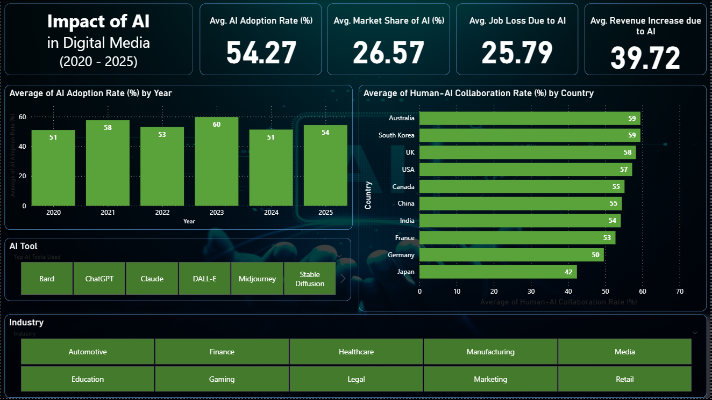
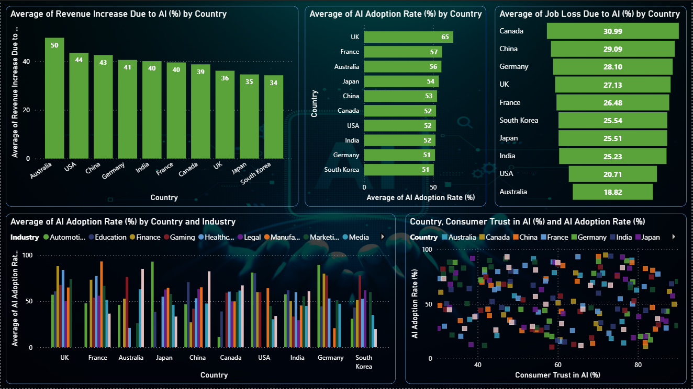
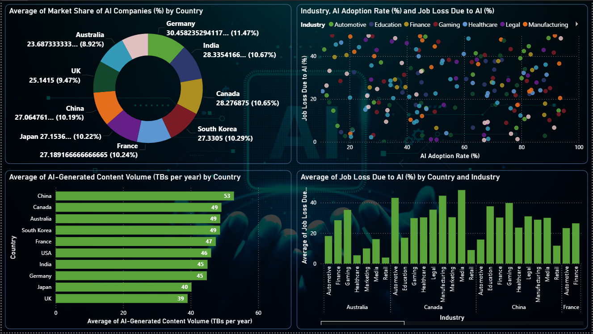

# Impact-of-AI---Analysis-using-Power-BI

## 1. Project Overview
This project provides a comprehensive analysis of the global impact of Artificial Intelligence (AI) on various sectors and economies. Leveraging a public dataset, the project explores key trends in AI adoption, its effect on revenue and employment, and the influence of regulatory environments on consumer trust.

## 2. Dataset
The core of this project is a detailed dataset on global AI content impact.

**Dataset Name:** Impact of AI on Digital Media 2020-2025

**Source:** https://www.kaggle.com/datasets/atharvasoundankar/impact-of-ai-on-digital-media-2020-2025

The dataset contains a variety of metrics including `Country`, `Year`, `Industry`, `AI Adoption Rate (%)`, `AI-Generated Content Volume (TBs per year)`, `Job Loss Due to AI (%)`, `Revenue Increase Due to AI (%)`, `Regulation Status`, and `Consumer Trust in AI (%)`.

## 3. Project Methodology
This project follows a complete data analysis lifecycle, from data acquisition and storage to visualization and insight generation.

**Data Acquisition:** The dataset was programmatically downloaded from Kaggle using Python. This ensures a reproducible and efficient data retrieval process.

**Data Storage:** The cleaned dataset was then exported and stored in a MySQL relational database. This step demonstrates proficiency in database management and prepares the data for integration with various Business Intelligence tools.

**Data Visualization & Analysis:** The data was imported from the MySQL database into Power BI. A series of interactive reports and dashboards were created to visualize the key trends and insights from the data.

## 4. Report Pages & Key Insights
The Power BI reports are divided into three main pages, each focusing on a different aspect of AI's impact.

### Page 1: Industry Specific Analysis
This page focuses on the differentiated impact of AI across various industries, highlighting which sectors are leading in revenue growth, content volume, and adoption rates.

**Key Visualizations:**

- A card highlights the `Average AI adoption Rate`: **54.57** from 2020 to 2025.

- A card highlights the `Average Market share of AI`: **26.57**.

- A card highlights the `Average of Human-AI collaboration Rate`: **25.79**.

- A card highlights the `Average Revenue increase due to AI`: **39.72**.  
  
- A column chart titled `Average AI adoption Rate(%) by Year` shows more in the year 2023 as **60%**.

- A bar chart displays the `Average Human-AI collaboration Rate(%) by Country` shows Australia has the most of **59%**.

**Key Insight:** The analysis shows that 2023 has the most AI adoption rate in th eperiod of 2020 to 2025 and Australia has the most Human-AI collaboration Rate.

### Page 2: Global AI Trends
This page provides a high-level overview of global AI trends, highlighting adoption rates, revenue growth, and job displacement across different countries.

**Key Visualizations:**

- A column chart titled `Average of Revenue Increase Due to AI (%) by country` identifies Australia, China, and USA are the top countries with the highest Avg Revenue Increase.

- A bar chart titled `Average of AI adoption Rate (%) by AI by country` identifies UK, France, and Australia are the top countries adopting AI the most.

- A bar chart titled `Average of Job Loss due to AI (%) by country` identifies Canada, China, and Germany are the top countries with Highest Job Loss.

- A column chart titled `Average of AI adoption Rate(%) by Country and Industry`.

- A Scatter plot titled `Country, Consumer Trust in AI(%) and AI adoption Rate(%)`.

**Key Insight:** AI adoption Rate and Revenue Increase due to AI is increasing rapidly on a global scale. Canada shows the highest job loss percentage, while the Australia leads in AI adoption.

### Page 3: Governance and Consumer Trust
This page explores the crucial relationship between government regulation, public perception, and the market dynamics of AI.

**Key Visualizations:**

- A Pie chart analyzes `Avg. of Market Share of AI companies (%) by Country` revealing that Germany has the most Market Share.

- A Scatter plot compares `Industry, AI Adoption Rate(%) and Job Loss Due to AI (%)`.

- A Bar chart `Average of AI-Generated Content Volume (TBs per year) by Country` shows China is generating the most content in AI.

- A Column Chart `Average of Job Loss Due to AI (%) by Country and Industry`.

**Key Insight:** China is the top country for AI-generated content, while Germany leads in market share, highlighting a complex and varied global AI landscape.

### 5. Technologies Used
**Data Extraction & Processing:** Python

**Database Management:** MySQL

**Business Intelligence & Visualization:** Power BI

### Author - BB Siva Venkatesh

This project is part of my portfolio, showcasing the End-to-End Data Analysis skills essential for data analyst roles. If you have any questions, feedback, or would like to collaborate, feel free to get in touch!

- **LinkedIn**: [Connect with me professionally](https://www.linkedin.com/in/siva-venkatesh/)

Thank you for your support, and I look forward to connecting with you!

